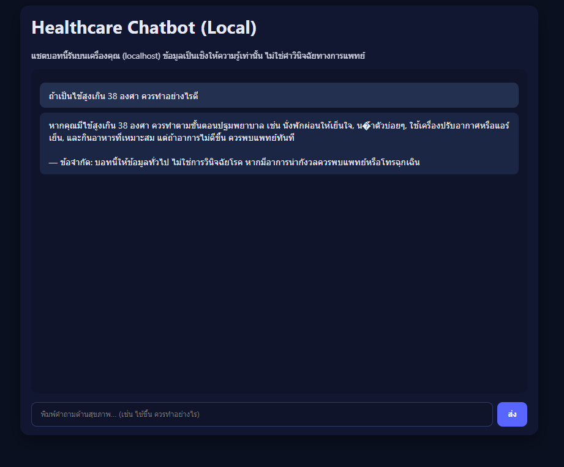
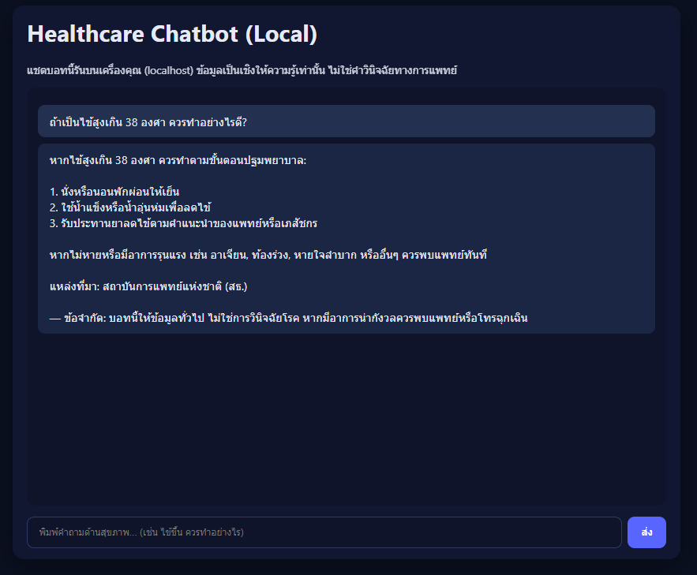

# Healthcare Chatbot — Local RAG (Flask + LangChain + Chroma)

โปรเจกต์แชตบอทด้านสุขภาพแบบรันบนเครื่อง (localhost) ปรับจากคอนเซ็ปต์ของ DSwithBappy โดย **ตัด AWS/Pinecone ออก** ใช้ **Chroma (local vector DB)** และเลือก LLM ได้ทั้ง **Ollama (local)** หรือ **OpenAI** ผ่านไฟล์ `.env`

> ⚠️ **คำเตือนสำคัญ**: บอทนี้ให้ข้อมูลเชิงความรู้ทั่วไป ไม่ใช่การวินิจฉัย/สั่งยา หากมีอาการฉุกเฉินให้ติดต่อหน่วยฉุกเฉินทันที

---

## คุณสมบัติเด่น
- **RAG ในเครื่อง**: เก็บ knowledge เป็นเวกเตอร์ด้วย Chroma (persistent directory)
- **LLM สลับได้**:
  - Local: Ollama (เช่น `llama3.1`) — ความเป็นส่วนตัวสูงสุด
  - Cloud: OpenAI (`gpt-4o-mini`) — ง่ายและแม่นขึ้นในบางกรณี
- **Safety-first**: system prompt ปฏิเสธการวินิจฉัย/สั่งยา และเตือนให้พบแพทย์เมื่อเหมาะสม
- **Flask UI**: หน้าเว็บแชตเรียบง่าย พร้อม endpoint `/chat`

---

## สถาปัตยกรรม (ภาพรวม)
```plaintext
ผู้ใช้ → UI (Flask) → /chat → RAG Chain
├─ Retriever (Chroma, k=4)
│ └─ Embedding: sentence-transformers/all-MiniLM-L6-v2
├─ Prompt (safety + context)
└─ LLM (Ollama หรือ OpenAI) → คำตอบ + Disclaimer
```
---
## โครงสร้างไฟล์
```plaintext
mental-health-llm-chatbot/
├─ app.py # Flask backend + /chat endpoint
├─ rag_chain.py # RAG chain: retriever + prompt + LLM.invoke()
├─ ingest.py # โหลด PDF/TXT/MD → chunk → embed → index to Chroma
├─ requirements.txt
├─ .env.sample # ตัวอย่างค่าตั้งค่า
├─ README.md # ไฟล์นี้
├─ templates/
│ └─ index.html # หน้าเว็บแชต
├─ static/
│ └─ style.css # ธีมหน้าเว็บ
├─ data/
│ └─ medical/
│ └─ README.txt # ใส่ไฟล์ PDF/TXT/MD ไว้ที่นี่
└─ chroma/ # (สร้างอัตโนมัติหลัง ingest; อาจลบทิ้งได้หาก schema ชน)
```

---

## การติดตั้งและรัน

### ตัวเลือก A: ใช้ Python venv
```bash
python -m venv .venv
# Windows
.\.venv\Scripts\activate
# macOS/Linux
# source .venv/bin/activate

pip install -r requirements.txt
```

### ตัวเลือก B: ใช้ Conda
```bash
conda create -n medibot-local python=3.10 -y
conda activate medibot-local
pip install -r requirements.txt
```

### ตั้งค่า .env

คัดลอกจาก .env.sample → .env แล้วเลือกโหมดใช้งาน

### โหมด Local ทั้งหมด (Ollama)

1. ติดตั้ง Ollama: https://ollama.com

2. ดึงโมเดลตัวอย่าง:
```bash
ollama pull llama3.1
```
3. ตั้งค่าใน .env:
```bash
LLM_BACKEND=ollama
OLLAMA_MODEL=llama3.1
CHROMA_DIR=./chroma
MAX_TOKENS=512
LANGUAGE_HINT=th
```

### โหมด OpenAI
```bash
LLM_BACKEND=openai
OPENAI_API_KEY=sk-...   # ใส่คีย์จริง
CHROMA_DIR=./chroma
MAX_TOKENS=512
LANGUAGE_HINT=th
```

## เตรียมเอกสารความรู้ (RAG)
1. วางไฟล์ลงใน data/medical/ รองรับ .pdf, .txt, .md

2. สร้างดัชนีเวกเตอร์:
```bash
python ingest.py
```
หากเคยใช้ Chroma เวอร์ชันอื่นแล้ว schema ชน (error: no such column: collections.topic) ให้ลบโฟลเดอร์ chroma/ ก่อนแล้ว ingest ใหม่

Windows: rmdir /s /q chroma

macOS/Linux: rm -rf chroma

## รันแอป

```bash
python app.py
```
เปิดเบราว์เซอร์ที่ http://127.0.0.1:5000

## การใช้งาน (ตัวอย่างคำถาม)

### อาการทั่วไป:

“ถ้าเป็นไข้สูงเกิน 38 องศา ควรทำอย่างไรดี?”

“ปวดท้องเฉียบพลันควรปฐมพยาบาลอย่างไร?”

### NCDs:

“โรคเบาหวานควรกินอาหารแบบไหน?”

“ความดันโลหิตสูงควรหลีกเลี่ยงอะไร?”

### ติดเชื้อ/ป้องกัน:

“วิธีล้างมือที่ถูกต้องตาม WHO มีกี่ขั้นตอน?”

“ไข้หวัดใหญ่กับไข้หวัดธรรมดาต่างกันอย่างไร?”

## ผล
### ตัวอย่าง V1

### ตัวอย่าง V2


